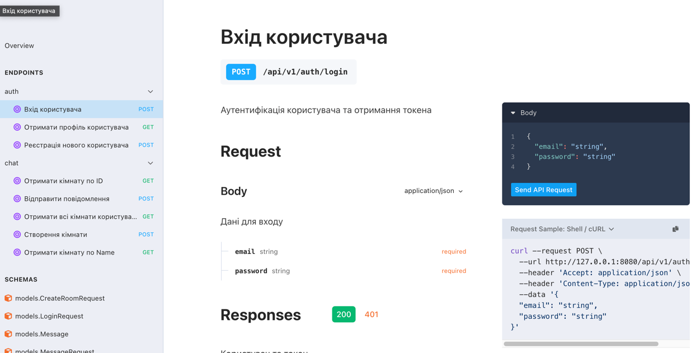

# go-robotdreams-diplom


# Оновити документацію Swagger
```swag init -g cmd/main.go </br>```


# Вирішення проблеми fiber v3 та підтримки swagger (підтримується тільки 2 версія swagger)
```
"github.com/gofiber/fiber/v3" </br>
"github.com/gofiber/fiber/v3/middleware/adaptor"  </br>
"github.com/gofiber/fiber/v3/middleware/cors"  </br>
"github.com/gofiber/fiber/v3/middleware/static"  </br>
httpSwagger "github.com/swaggo/http-swagger/v2"  </br>
```
** **httpSwagger "github.com/swaggo/http-swagger/v2" </br>**

# Логування
[github.com/sarff/iSlogger](github.com/sarff/iSlogger) як зовнішній пакет </br>


# Документація API 
### swagger: http://127.0.0.1:8080/swagger


### stoplight: http://127.0.0.1:8080/docs
